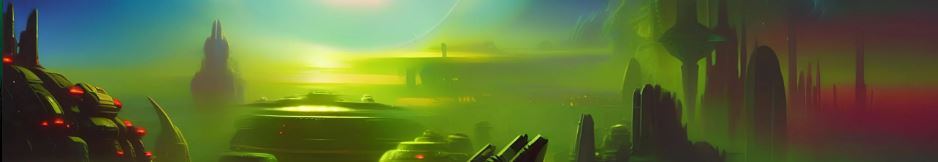

# Uplift Octopus

Uplift Octopus is a fan-based, divulgation, nonprofitable project. We expect to add value to the experience of reading and playing the creative commons game: Eclipse Phase.
The target audience is double: We aim for experienced players, and we give them tips and guidance to learn further, and we aim for people that are unfamiliar with this universe, and we try to engage them and wake up their interest in this great game.

The goals we aim for are:
- In terms of technical features:
    - To create a good user experience, free of bugs.
    - To create a web page accessible to impaired readers.
    - To create a web page that combines Responsive and Adaptive design.
    - To create a web page with links to internal and external sites to complement the information.
    - To create a web page with embedded videos and images. 
    - To create an almost functional form, lacking only the capability to keep the user's answers for technical reasons (we do not have access to a server to keep the answer at this point)

- In terms of design:
   - To present the information in a way that is easy to understand to people unfamiliar with the topics.
   - To present the information in such a way, that the most experienced players could learn new things or think about known things from a new perspective.
   - To create a natural workflow, that would lead the users from one page to the next intuitively.
   - To create a coherent feeling, sharing a similar structure throughout the entire project.
   - To create a visual language, letting the user know their location within the project, looking at the color of the links.
   - To find Fonts and styles that help us to evoke imagination and science fiction.
   
- In terms of License:
   - To ensure Creative Commons allows me to develop this project.
   - To ensure my web page is made for non-commercial purposes.
   - To correctly refer to the rest of the media shared (YouTube Videos)
   - To attribute the game to Posthuman Studios.
   - To credit and thank Posthuman Studios and Eclipse Phase as the creative Commons source material.
   - To ensure all the media embedded in the project is legal to use.

- From a user perspective:
   - To present to new audiences the Role Playing Games in general, and the game "Eclipse Phase" in particular.
   - To create an interest in the game "Eclipse Phase" by explaining the basics and presenting some interesting and unique pieces of information.
   - To help experienced players of the game to enjoy their experience even further.
   - To help experienced players to navigate all manuals in search of valuable information in regards to the "Uplift Octopus", and to serve them as a reading guide.
   - To help experienced players to try to roleplay an Uplift Octopus, sharing tips and advice.

## Features

### Existing Features

- __Header Navigation Bar__

  - Featured on all five pages, the full responsive navigation bar includes links to the Home page, Reading guide, Tips, Links, and Feedback page and is identical on each page to allow for easy navigation.
  - This section will allow the user to easily navigate from page to page across all devices without having to revert to the previous page via the ‘back’ button.
- This section refers to these sections by short intuitive names when the screen size allows it and intuitive icons when the screen is too small.
- This section refers to every page by short intuitive names when the screen size allows it and intuitive icons when the screen is too small.
- The navigation bar uses an intuitive color code that signals what page you are currently on.

- __Title__

- Featured on all five pages, the full responsive title includes a main title, a subtitle, and an image. The title and subtitle are identical on each page to allow easy navigation. The picture varies from page to page, but it keeps the style and the size, allowing a coherent design and a good emotional response.
- The title and subtitle use fonts downloaded from google fonts, and the images belong to the collection "A densely populated alien planet.", posted on Reddit by the user aihellnet. I credit his work on the links page.
- The title and subtitle are relatively long descriptions when the screen size allows it, and shorter versions of the text when the screen is too small.

- The picture is set up to cover the full width of the screen, and it adjusts itself depending on the size of the screen. We used a different one for every page.

 
- __Three columns section__

- Featured on all five pages, these columns hold all the content in an organized manner.
- This section is fully responsive and is used to form three columns, that will merge into one when the screen is too narrow.
- This content is divided into a title, paragraphs, and supporting elements. The title and paragraphs use fonts downloaded from google fonts. 

- __Footer Navigation button__

  - Featured on all five pages, the full responsive navigation button includes a link to the next page. This button works the same way on the first four pages. The button is identical on each page to allow for easy navigation.
  - On the feedback page, the button leads nowhere. Instead, it becomes a submit button for the form that can be found on the feedback page.
- These buttons include a small sentence that invites the user to visit the following page when the page width allows it. This text becomes "Next!" when the screen size becomes too narrow.
- On the feedback page, the button displays the text "Submit!" on every screen size.

- __Footer Image__

- Featured on all five pages, the footer image contains a purple background, and a series of short sentences intended to evoke feelings in the user.
Using one of the most powerful spaces on the web (the bottom), this image provides closure to every piece of content and tries to convey everything said earlier with positive feelings.

- __Feedback form__

- Embedded within the column section, this form has two parts. In the first one, the user is asked for some personal details. In the second one, he is asked for feedback about the whole page. 
- This section includes radio buttons, text areas, and text inputs. 
- This section lacks a fully functional submit button, as we do not have the resources to store the user's answers.

### Features Left to Implement

- __Fully functional feedback form__

- When possible, we will add everything needed to store the answers to the form.

- __Index Page__

- If enough people find this project useful, this project could become one of many reading guides, embedded in a greater page that serves as an index.

## Testing

- Every button, link, external link, text area, input text, and radio button has been tested on every browser and device possible. 
- This site has been tested on the following browsers: Mozilla Firefox, Google Chrome, Microsoft Edge, and Opera. It works similarly in all of them.
- This site has been tested using Google Chrome developer tools, and the responsive and adaptive features work correctly in all sizes listed.
- We made manual revisions throughout the code, looking for inconsistencies, CSS lines with no effect on the code, bad syntax, uncommented sections, and style or content bugs. Many have been found and fixed.
- The content has been searched for grammatical errors using the Grammarly platform.
- In the process of fixing errors, we have given special attention to:
	- We changed the original header image, as we didn't have the license to use it. This happened as well with one of the embedded videos. After reading Youtube's terms and conditions, it could be an infringement of Youtube policies.
	- We changed the original header image, as we didn't have the license to use it. This happened as well with one of the embedded videos. After reading Youtube's terms and conditions, it could be an infringement of Youtube policies.
	- We moved all Google sheets imports to a library, as the links were mentioned in the W3C Validator tool.
	- I fixed some duplicated Ids: this was helpful to a better understanding of the difference between Class and Id.
	- I fixed an instance where I set up the width to a percentage using HTML. I used CSS and learned a useful hint about HTML good practices.
	-I fixed some Section elements that did not start with an h2-h6 element. This was helpful in a better understanding of the syntax of a Section.
	- I fixed an instance in which I added an anchor inside of a button. This was a bit difficult to solve, as I tried several approaches. I tried using the onClick element, nesting the button inside an anchor, etc. Finally, it worked using a form instead of a button. I learned a useful hint about HTML good practices.

  ### Validator Testing

- HTML 
    - No errors were returned when passing through the official 
    [W3C validator](https://validator.w3.org/nu/?doc=https%3A%2F%2Fcefeidas.github.io%2FUplift-octopus%2F)
- CSS
  - No errors were found when passing through the official [(Jigsaw) validator](https://jigsaw.w3.org/css-validator/validator?uri=https%3A%2F%2Fcefeidas.github.io%2FUplift-octopus%2F&profile=css3svg&usermedium=all&warning=1&vextwarning=&lang=es)

### Unfixed Bugs

- There are no bugs left unfixed that we are aware of.

## Deployment

- The site was deployed to GitHub pages. The steps to deploy are as follows: 
  - In the GitHub repository, navigate to the Settings tab 
  - From the source section drop-down menu, select the Master Branch
  - Once the master branch has been selected, the page will be automatically refreshed with a detailed ribbon display to indicate the successful deployment. 

The live link can be found here - https://cefeidas.github.io/Uplift-octopus/

## Credits

- The text of the content was written by me, using the topics discussed in Eclipse Phase, and my personal experience with RPGs.
- The fonts and Icons used were imported from Google Fonts.
    - Fonts: https://fonts.google.com/
    - Icons: https://fonts.google.com/icons
- The Header images were cropped from the collection "A densely populated Alien Planet" created by aihellnet using an AI and published in Reddit under a creative commons license. You can find a link to the original work here.
    - https://www.reddit.com/r/wallpaper/comments/yj2mrg/a_densely_populated_alien_planet_2560x1440/
- The text in the footer was taken from Eclipse Phase core Manual.
    - Page 2 of the PDF
    - https://robboyle.files.wordpress.com/2014/05/ps21000_eclipsephase_4thprinting.pdf
- The image of the octopus was cropped from the Eclipse Phase book called Panopticon in PDF.
    - Page 144 of the PDF
    - https://robboyle.files.wordpress.com/2011/09/ps21101_ep_panopticon.pdf
- The embedded videos were taken from Youtube, and I ensured the creator and the video owners were the same people to avoid Youtube infringement.
    - https://www.youtube.com/watch?v=BF5gdvMyuOs
    - https://youtu.be/RVmuU04-X5E